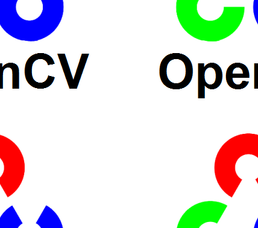
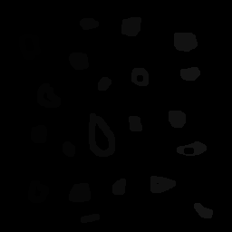
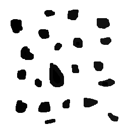
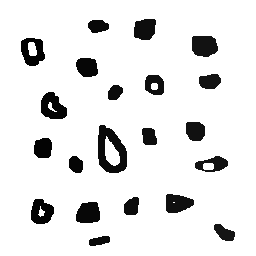
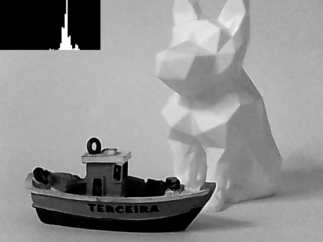
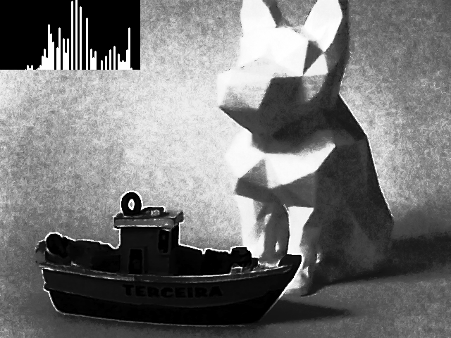
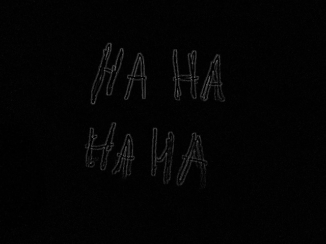
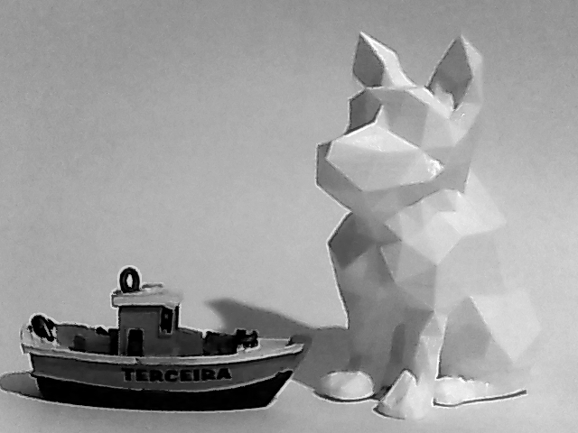
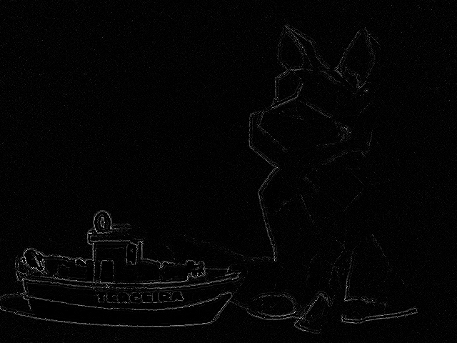
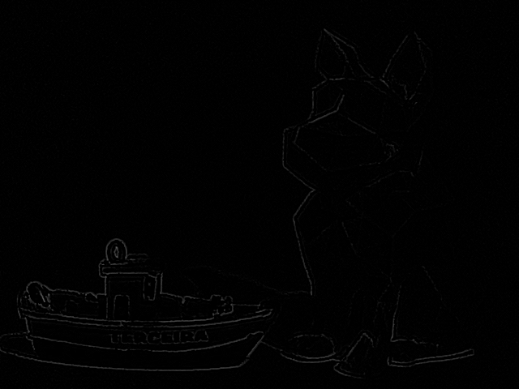

= Processamento Digital de Imagens
Igor Barbosa <igor.barbosa.705@ufrn.edu.br>
Última atualização 25/10/2022
:toc: left
:icons: font
:source-highlighter: highlight.js
:url-quickref: https://docs.asciidoctor.org/asciidoc/latest/syntax-quick-reference/

A presente página sofrerá alterações no decorrer do semestre.

//###################################################################################
== 1. Regions
Neste primeiro exercício pedia-se:
====
Utilizando o programa _exemplos/pixels.cpp_ como referência, implemente um programa *regions.cpp*. Esse programa deverá solicitar ao usuário as coordenadas de dois pontos *P1* e *P2* localizados dentro dos limites do tamanho da imagem e exibir que lhe for fornecida. Entretanto, a região definida pelo retângulo de vértices opostos definidos pelos pontos *P1* e *P2* será exibida com o *negativo* da imagem na região correspondente.
====

A solução da problemática está demonstrada abaixo. O código foi desenvolvido utilizando a linguagem _Python_.

.Código completo
[source,python]
----
include::./1.regions/regions.py[]
----

Para separarmos a imagem em 4 quadrantes é necessário descobrirmos o centro, por isso, nesta etapa do programa
Agora, vamos destrinchar o programa, começando pela importação da biblioteca do OpenCV.

.Importação da biblioteca do OpenCV
[source,python]
----
# Nome:  regions.py
# Autor: Igor Barbosa
# Última atualização : 23/10/2022

import cv2 as cv
----

Após a declaração da biblioteca, temos a importação da imagem que será tratada pelo código. A imagem está representada pela _Figure 1_, se trata do logo do OpenCV. Podemos perceber que a imagem encontra-se colorida. Por isso, ao carregarmos a figura já a transformamos para a escala de cinza. 

.Entrada da imagem
[source,python]
----
img = cv.imread('./1.regions/OpenCV_Logo.png',cv.IMREAD_GRAYSCALE)
cv.namedWindow('Imagem selecionada')
cv.imshow('Imagem selecionada', img)
----
//This is a paragraph with a *bold* word and an _italicized_ word.

.Imagem de entrada : Logo do OpenCV colorido.

Após a entrada da imagem, temos a parte a medição do tamanho da mesma e a exibição das medições de altura e largura para o usuário definir os pontos que serão transformados na parte negativa.

.Tamanho da imagem
[source,python]
----
height, width = img.shape[:2]
print("A altura da imagem é: ", height)
print("A largura da imagem é: ", width)
----

Finalmente, o usuário poderá colocar as coordenadas dos pontos _P1_ e _P2_. Utilizamos uma lógica tal qual o usuário só consiga inserir valores das coordenadas dos pontos que sejam válidos. Caso ele insira um valor inválido, ficará em um _loop_ até que insira um valor aceitável. Este valor aceitável está relacionado com as medidas da imagem mensuradas anteriormente. Caso o usuário insira um valor que não seja um número ou um número que seja menor que 0 ou maior que o tamanho da imagem (um ponto que saia das dimensões da imagem), não será aceito.

.Inserção dos pontos P1 e P2
[source,python]
----
while not (px1 := input('Coordenada X do P1: ')).isdigit() or (px1:=int(px1)) < 0 or px1 > height:
    print('Valor INVÁLIDO')
while not (py1 := input('Coordenada Y do P1: ')).isdigit() or (py1:=int(py1)) < 0 or py1 > width:
    print('Valor INVÁLIDO')
while not (px2 := input('Coordenada X do P2: ')).isdigit() or (px2:=int(px2)) < 0 or px2 > height:
    print('Valor INVÁLIDO')
while not (py2 := input('Coordenada Y do P2: ')).isdigit() or (py2:=int(px2)) < 0 or py2 > width:
    print('Valor INVÁLIDO')
----

Com os pontos corretos e definidos, utilizamos dois laços, um para cada eixo da imagem, para que percorra toda a área selecinada e aplique o negativo na mesma. Para aplicar o negativo, basta pegar o valor do _pixel_ de entrada e substrair de 255 (valor que representa o branco), assim como demonstrado a seguir.

.Tratamento da área negativa da imagem
[source,python]
----
for x in range (min(px1,px2),max(px1,px2)):
    for y in range (min(py1,py2),max(py1,py2)):
        img[x,y] = 255 - img[x,y]
----

Como podemos ver, a área negativa da imagem tratada fora sobrescrita na imagem tratada para a escala cinza.

Por fim, temos o encerramento do programa e o armazenamento da imagem tratada.

.Encerramento e armazenamento da imagem tratada
[source,python]
----
cv.namedWindow('Resultado') 
cv.imshow('Resultado', img)  
cv.waitKey()
cv.imwrite('./1.regions/Output.png',img)
cv.destroyAllWindows()
----

Para os pontos definidos _P1(10,10)_ e _P2(250,250)_ temos como saída a Figure 2.

.Saída do código para os pontos P1(10,10) e P2(250,250).

//###################################################################################
== 2. Trocaregioes
Neste segundo exercício pedia-se:
====
Utilizando o programa _exemplos/pixels.cpp_ como referência, implemente um programa *trocaregioes.cpp*. Seu programa deverá trocar os quadrantes em diagonal na imagem. Explore o uso da classe _Mat_ e seus construtores para criar as regiões que serão trocadas.
====

A solução da problemática está demonstrada abaixo. Como o código foi desenvolvido utilizando a linguagem _Python_, a classe _Mat_ não fora utilizada.

.Código completo
[source,python]
----
include::./2.trocaregioes/trocaregioes.py[]
----

Primeiramente, temos a declaração das bibliotecas OpenCV e NumPy. A primeira será utilizada para o trabalho com a imagem, que por sinal será a mesma do Exercício 1, e a biblioteca NumPy será utilizada para se trabalhar com as matrizes das divisões da imagem. 

Após a declaração das bibliotecas, temos o passo de carregar a imagem, este procedimento é o mesmo do Exercício 1.

.Inicialização do código
[source,python]
----
import cv2 as cv
import numpy as np

img = cv.imread('./2.trocaregioes/OpenCV_Logo.png',cv.IMREAD_COLOR)
cv.namedWindow('Imagem selecionada')
cv.imshow('Imagem selecionada', img)
----

Para dividirmos a imagem em quatro quadrantes, optamos por achar um ponto em cada eixo que tivesse a característica central. Para isso, como demonstrado abaixo, pegamos as dimensões da imagem e usamos o operador *//* no qual retorna um valor inteiro do resultado da divisão, por isso que dizemos um ponto com "característica central", pois, pode não ser o centro propriamente dito.

.Procura dos pontos centrais dos eixos
[source,python]
----
height, width = img.shape[:2]
h_centro, w_centro = height//2 , width//2
----

Com os pontos centrais, dividimos a imagem em quatro partes:

.Limites dos quadrantes
|===
|Quadrante | Y | X

|Quadrante 1
|Do centro até o tamanho total da largura da imagem
|Do zero até o ponto central

|Quadrante 2
|Do zero até o ponto central
|Do zero até o ponto central

|Quadrante 3
|Do zero até o ponto central
|Do centro até o tamanho total da altura da imagem

|Quadrante 4
|Do centro até o tamanho total da largura da imagem
|Do centro até o tamanho total da altura da imagem
|===

Podemos perceber que os quadrantes adotados seguem o padrão da _Figure 3_. Cabe a destacarmos que o _X_ e o _Y_ da Figura não são os adotados no programa. Colocamos a esta ilustração apenas para facilitar o entendimento das divisões dos quadrantes, no caso, o sentido da divisão. Os eixos _X_ e _Y_ continuam sendo os adotados pelo OpenCV e padrão no Processamento Digital de Imagens.

.Ilustração de base para o entendimento da divisão da imagem.
image::./imagens/Quadrantes.png[]

A parte do programa dedicado em dividir os quadrantes é esta:

.Divisão dos quadrantes
[source,python]
----
q1 = img[0:h_centro, w_centro:width]
#h1, w1 = q1.shape[:2]                      #teste Q1
#print(h1,w1)
#cv.namedWindow('Quadrante 1')
#cv.imshow('Quadrante 1', q1)

q2 = img[0:h_centro, 0:w_centro]
#h2, w2 = q2.shape[:2]                      #teste Q2
#print(h2,w2)
#cv.namedWindow('Quadrante 2')
#cv.imshow('Quadrante 2', q2)

q3 = img[h_centro:height, 0:w_centro]
#h3, w3 = q3.shape[:2]                      #teste Q3
#print(h3,w3)
#cv.namedWindow('Quadrante 3')
#cv.imshow('Quadrante 3', q3)

q4 = img[h_centro:height, w_centro:width]
#h4, w4 = q4.shape[:2]                      #teste Q4
#print(h4,w4)
#cv.namedWindow('Quadrante 4')
#cv.imshow('Quadrante 4', q4)
----

Os testes são para observar se os quadrantes estão divididos da forma certa.

Com os quadrantes divididos, realizamos a troca dos mesmos. Para tal, usamos a biblioteca NumPy, mais precisamente a função _numpy.concatenate_, para juntar as matrizes formadas.

.Troca dos quadrantes
[source,python]
----
q43 = np.concatenate((q4,q3),axis=1)
q12 = np.concatenate((q1,q2),axis=1)
img = np.concatenate((q43,q12),axis=0)
----

Na primeira linha da parte do código mostrado acima, juntamos horizontalmente (demonstrado por _axis=1_) os quadrantes 4 e 3. Na segunda linha, os quadrantes 1 e 2. Por fim, juntamos verticalmente as duas matrizes formadas anteriormente, tendo como consequência a troca total dos quadrantes.

Para uma entrada sendo a imagem da _Figure 1_, que é a logo do OpenCV colorida, teremos como saída a _Figure 4_.

.Ilustração de base para o entendimento da divisão da imagem.

//###################################################################################
== 3. Labeling
Neste terceiro exercício pedia-se:
====
Aprimore o algoritmo de contagem apresentado para identificar regiões com ou sem buracos internos que existam na cena. Assuma que objetos com mais de um buraco podem existir. Inclua suporte no seu algoritmo para não contar bolhas que tocam as bordas da imagem. Não se pode presumir, a priori, que elas tenham buracos ou não.
====

A solução da problemática está demonstrada abaixo. O código foi desenvolvido utilizando a linguagem _Python_.

.Código completo
[source,python]
----
include::./3.labeling/labeling.py[]
----

Para este exercício utilizamos como entrada a imagem da _Figure 5_.

.Imagem de entrada.
image::./3.labeling/bolhas.png[]

Como podemos ver, apesar de termos as presenças das bolhas que são "cortadas" pelas bolhas, não podemos abstrair se as mesmas possuem buracos ou não. Então, teremos que desconsiderá-las.

Para tal, as bolhas estão com o nível máximo de brilho (255), portanto, para eliminarmos as bolhas das bordas, basta andarmos pelas bordas e quando existir um pixel com o nível 255, aplicamos _cv.floodFill_ no mesmo pixel, com a cor de preenchimento sendo o nível 0.

.Parte do código destinada a retirar as bolhas das bordas
[source,python]
----
height, width = img.shape[:2]
print("A altura da imagem é: ", height)
print("A largura da imagem é: ", width)

#retirando as bolhas das bordas
#bordas verticais
for y in [0,width-1]:
    for x in range (height):
        if img[x,y] == 255:
            cv.floodFill(img, None, (y,x), 0)
#bordas horizontais
for x in [0,height-1]:
    for y in range (width):
        if img[x,y] == 255:
            cv.floodFill(img, None, (y,x), 0)
cv.imwrite('./3.labeling/bolhas_bordas_retiradas.png',img)
cv.namedWindow('Bordas Retiradas') 
cv.imshow('Bordas Retiradas', img)  
----

Como resultado desta parte do código temos a _Figure 6_.

.Imagem de entrada sem as bolhas das bordas.
image::./3.labeling/bolhas_bordas_retiradas.png[]

Agora, fazemos um laço que irá percorrer toda a imagem, quando tivermos os níveis 255, significa que "estaremos no objeto/bolha". Utilizando novamente o _cv.floodFill_, iremos aplicar uma nova tonalidade para a bolha e será única. Utilizando deste detalhe, somos capazes de contar a quantidade de bolhas presentes na imagem.

Na parte do código abaixo, temos a variável *nbolhas*, que se inicia com 0. Quando a cor branca (255) é detectada, adicionamos 1 na variável e o número vigente armazenado em *nbolhas* será a nova tonalidade do objeto detectado. 

.Parte do código destinada a contar o total de bolhas
[source,python]
----
#contando o número total de bolhas
nbolhas = 0
for y in range (width):
    for x in range (height):
        if img[x,y] == 255:
            nbolhas = nbolhas + 1
            cv.floodFill(img, None, (y,x), nbolhas)
cv.imwrite('./3.labeling/bolhas_pintadas.png',img)
cv.namedWindow('Bolhas pintadas') 
cv.imshow('Bolhas pintadas', img)  
----

No final da contagem teremos o número total de bolhas e percebemos que, na imagem de saída nesta etapa do programa, a tonalidade das bolhas vai ficando mais clara conforme visto na _Figure 7_.

.Bolhas com tonalidades distintas.

Com todas as bolhas endereçadas e sem a utilização do branco (255) na imagem, fazemos uma mudança de cor no fundo, que no caso é preto (0), para branco (255). Para garantirmos esta mudança, escolhemos algum ponto da borda, pois, com o tratamento de retirada das bolhas das bordas, temos a certeza que nesses locais não existirão pontos com o nível de brilho 255.

.Mudança do fundo para a cor branca (255)
[source,python]
----
#contando o número total de bolhas com buracos
cv.floodFill(img, None, (0,0), 255)
cv.imwrite('./3.labeling/fundo_pintado.png',img)
cv.namedWindow('Fundo pintado') 
cv.imshow('Fundo pintado', img) 
----

Escolhemos o ponto (0,0) e aplicamos a função _cv.floodFill_ novamente. Tendo como saída a _Figure 8_.

.Mudança do fundo para a cor branca (255).

Neste momento, as únicas regiões com a cor preta (0) são os buracos das bolhas. Portanto, utilizando uma lógica idêntica à utilizada para contar as bolhas, contaremos as bolhas com buracos.

.Contagem das bolhas com buracos.
[source,python]
----
nbolhasburacos = 0
for y in range (width):
    for x in range (height):
        if img[x,y] == 0:
            nbolhasburacos = nbolhasburacos + 1
            cv.floodFill(img, None, (y,x), 255)
----

Por fim, temos como resultado:

[source,python]
----
Número total de bolhas: 21
Número total de bolhas com buracos: 7
----

.Imagem final do programa labeling.py.

=== 3.1. Problemática
Ainda neste exercício, nos é levantado a seguinte problemática: 
====
Observando-se o programa labeling.cpp como exemplo, é possível verificar que caso existam mais de 255 objetos na cena, o processo de rotulação poderá ficar comprometido. Identifique a situação em que isso ocorre e proponha uma solução para este problema.
====
Acreditamos que se passar dos 254 objetos já teremos problemas, pois, uma tonalidade estará ligado aos buracos e a outra ao fundo.

A situação em que isso pode ocorrer é uma cena ou imagem relativamente grande com a presença de objetos consideravelmente pequenos, com estas duas premissas, teremos a grande chance de passarmos dos 254 objetos.

Uma forma de contornar esta problemática, seria trabalharmos com cores, aumentando a quantidade de objetos para _256x256x256-2 =_ *16.777.214*. Entretanto, ao trabalharmos com cores, estaríamos triplicando a quantidade de informação, pois, cada pixel agora carregaria 3 bytes de dados.

Outra forma que talvez seja menos custosa computacionalmente, seria aumentar a resolução da escala de cinza, no caso, trabalhando com 2 bytes, agora duplicaríamos o volume de dados para conseguirmos trabalhar com _256x256-2 =_ *65.536* objetos.

//###################################################################################
== 4. Equalize
Neste quarto exercício pedia-se:
====
Utilizando o programa _exemplos/histogram.cpp_ como referência, implemente um programa *equalize.cpp*. Este deverá, para cada imagem capturada, realizar a equalização do histogram antes de exibir a imagem. Teste sua implementação apontando a câmera para ambientes com iluminações variadas e observando o efeito gerado. Assuma que as imagens processadas serão em tons de cinza.
====

A solução da problemática está demonstrada abaixo. O código foi desenvolvido utilizando a linguagem _Python_.

.Código completo
[source,python]
----
include::./4.equalize/equalize.py[]
----

Neste exercícios iremos utilizar as bibliotecas do OpenCV e NumPy. O código começa com a chamada para utilização da _webcam_ através de _cv.VideoCapture(0)_. Se estiver tudo certo com a captura da imagem, o programa entra em um _loop_ orientado pela variável *validacao*, que está ligado com o _status_ de conexão da _webcam_, ou seja, enquanto o dispositivo de captura estiver conectado, o código permanecerá executando o _loop_.

O método _webcam.read()_ fornece o _status_ de conexão do dispositivo de captura e o frame do momento de execução.

Logo após, temos o _frame_ capturado transformado para a escala cinza e armazenado em *framegray*. Utilizando a função _cv.equalizeHist_, equalizamos o frame capturado e armazenamos em *histEqualize*.

.Bibliotecas, captura de vídeo e transformação dos frames
[source,python]
----
import cv2 as cv
import numpy as np

webcam = cv.VideoCapture(0)

if webcam.isOpened():
    validacao, frame = webcam.read()

    while validacao:
        validacao, frame = webcam.read()
        framegray = cv.cvtColor(frame, cv.COLOR_BGR2GRAY)
        histEqualize = cv.equalizeHist(framegray) #imagem Equalizada
----

Através do método _cv.calcHist_ é gerado o histograma de cada imagem.

.Geração e definição do tamanho dos histogramas
[source,python]
----
        #Geração dos histogramas
        histSize = 64
        hist = cv.calcHist(framegray, [0], None, [histSize], (0,255), False)
        histEqual = cv.calcHist(histEqualize, [0], None, [histSize], (0,255), False)

        #Tamanho dos histogramas
        hist_w = 200
        hist_h = 100
        bin_w = int(round(hist_w/histSize))
----

Para a manipulação das imagens dos histogramas utilizamos a biblioteca _NumPy_. Para normalização dos histogramas utilizamos o método _cv.normalize_ do próprio OpenCV.

.Geração das matrizes dos histogramas e normalização dos mesmos
[source,python]
----
        #Matrizes dos histogramas
        histImage = np.zeros((hist_h, hist_w), dtype=np.uint8)
        histImageEqual = np.zeros((hist_h, hist_w), dtype=np.uint8)

        #Normalização dos histogramas
        cv.normalize(hist, hist, 0, hist_h, norm_type=cv.NORM_MINMAX)
        cv.normalize(histEqual, histEqual, 0, hist_h, norm_type=cv.NORM_MINMAX)
----

Finalmente, com todos os dados obtidos e tratados, poderemos gerar as representações dos histogramas. Para tal, utilizamos o método _cv.line_.

.Histogramas transformados em imagens
[source,python]
----
        for i in range(1, histSize):
            cv.line(histImage, (bin_w*(i), hist_h - int(hist[i])),
                               (bin_w*(i), hist_h),
                               (255, 255, 255), thickness=2)
            cv.line(histImageEqual, (bin_w*(i), hist_h - int(histEqual[i])),
                               (bin_w*(i), hist_h),
                               (255, 255, 255), thickness=2)
----

Tendo como resultado final:

.Frame capturado junto ao seu histograma.

.Frame capturado e equalizado junto ao seu histograma.

//###################################################################################

== 5. Motiondetector
Neste quinto exercício pedia-se:
====
Utilizando o programa _exemplos/histogram.cpp_ como referência, implemente um programa *motiondetector.cpp*. Este deverá continuamente calcular o histograma da imagem (apenas uma componente de cor é suficiente) e compará-lo com o último histograma calculado. Quando a diferença entre estes ultrapassar um limiar pré-estabelecido, ative um alarme. Utilize uma função de comparação que julgar conveniente.
====

A solução da problemática está demonstrada abaixo. O código foi desenvolvido utilizando a linguagem _Python_.

.Código completo
[source,python]
----
include::./5.motiondetector/motiondetector.py[]
----

Muitas funcionalidades são idênticas ao exercício anterior, por isso, vamos focar apenas no que foi feito para a problemática em questão.

Primeiramente, dentro do _while_ de captura de imagem da _webcam_, pegamos dois frames, separados pelo tempo presente no método _cv.waitKey()_. Depois, geramos os histogramas dos respectivos _frames_ e comparamos através do método _cv.compareHist_. Caso a comparação forneça um valor abaixo de *limiar=0.94*, emitimos um alerta de _"Motion Detected".

.Detecção de movimento
[source,python]
----
        frame1 = cv.cvtColor(quadro1, cv.COLOR_BGR2GRAY)
        cv.waitKey(25)
        quadro2 = webcam.read()[1]         #frame atual
        frame2 = cv.cvtColor(quadro2, cv.COLOR_BGR2GRAY)
        
        #Geração dos histogramas
        histSize = 64
        histframe1 = cv.calcHist(frame1, [0], None, [histSize], (0,255), False)
        histframe2 = cv.calcHist(frame2, [0], None, [histSize], (0,255), False)

        #Comparação dos histogramas
        limiar = cv.compareHist(histframe1, histframe2, cv.HISTCMP_CORREL)
        if limiar < 0.94 : #limiar definido para detecção de movimento
            cv.putText(frame2, 'Motion Detected!', (300,400), cv.FONT_ITALIC, 1, (0,0,0), thickness=2)
----

Para a demonstração do funcionamento do algoritmo, utilizamos a biblioteca *imageio*, na qual, ao clicarmos em uma tecla, armazena-se _frames_ e depois cria-se um arquivo _.gif_.

.Parte do código destinada a gravação de um arquivo .gif.
[source,python]
----
import imageio

gif = []

 #Ao apertar a tecla "a", o programa irá armazenar os frames para gerar um gif
        if key == ord("a"):
            gif.append(frame2)
        
#geração do gif através da biblioteca imageio
print("Saving GIF file")
with imageio.get_writer("./5.motiondetector/resultado.gif", mode="I") as writer:
    for idx, frame in enumerate(gif):
        print("Adding frame to GIF file: ", idx + 1)
        writer.append_data(frame)
----

Tendo como saída:

.Saída do programa motiondetector.py.
image::./5.motiondetector/resultado.gif[]

=== 5.1. Aidentudetector

====
_Eis que um Cearense começa a aprender PDI..._
====

.Aidentudetector em pleno funcionamento.
image::./imagens/aidentu.gif[]

.Humor laplaciano.

//###################################################################################
== 6. Laplgauss
Neste sexto exercício pedia-se:
====
Utilizando o programa _exemplos/filtroespacial.cpp_ como referência, implemente um programa *laplgauss.cpp*. O programa deverá acrescentar mais uma funcionalidade ao exemplo fornecido, permitindo que seja calculado o laplaciano do gaussiano das imagens capturadas. Compare o resultado desse filtro com a simples aplicação do filtro laplaciano.
====

A solução da problemática está demonstrada abaixo. O código foi desenvolvido utilizando a linguagem _Python_.

.Código completo
[source,python]
----
include::./6.laplgauss/laplgauss.py[]
----

Neste exercício, utilizamos as bibliotecas do OpenCV e NumPy. O NumPy será usado com as máscaras, que nesse caso serão duas: uma máscara de gauss, que permite o borramento, e uma máscara de laplaciano, que permite a obtenção das bordas.

.Bibliotecas e máscaras
[source,python]
----
import cv2 as cv
import numpy as np

#máscaras dos filtros
gauss = np.array([[0.0625, 0.125, 0.0625]   #borramento
                ,[0.125, 0.25, 0.125]
                ,[0.0625, 0.125, 0.0625]])

laplacian = np.array([[0, -1, 0]
                     ,[-1, 4, -1]
                     ,[0, -1, 0]])
----
Depois, teremos o trabalho com a câmera e os tratamentos dos frames capturados utilizando o método _cv.cvtColor_, para transformar o frame colorido para escala cinza, e _cv.filter2D_ para aplicação das máscaras.

.Câmera e tratamento dos frames
[source,python]
----
webcam = cv.VideoCapture(0)

if webcam.isOpened():
    validacao, frame = webcam.read()

    while validacao:
        validacao, frame = webcam.read()
        framegray = cv.cvtColor(frame, cv.COLOR_BGR2GRAY) #aquisição original
        cv.imshow("Aquisicao", framegray)

        framegaussiano = cv.filter2D(framegray, -1, gauss)
        cv.imshow('Borramento', framegaussiano)

        framelaplaciano = cv.filter2D(framegray, -1, laplacian)
        cv.imshow('Laplaciano', framelaplaciano)

        framelaplgauss = cv.filter2D(framegaussiano, -1, laplacian)
        cv.imshow('LaplGauss', framelaplgauss)
----

Como saída temos:

.Frame transformado para escala de cinza.

.Frame com borramento (máscara gaussiana).
image::./6.laplgauss/FrameGaussiano.png[]

.Frame com Laplaciano.

.Frame com Laplaciano após o borramento.

A máscara de Gauss é aplicada com o intuito de diminuir o ruído e realçar as bordas. Quando aplicamos o filtro laplaciano na imagem pura, temos o aspecto das bordas mais nítidas, porém, com uma relevante presença de ruído.

Ao aplicarmos o filtro de gauss e depois o laplaciano, obtemos as bordas de maneira mais suave, porém, nitidamente mais puras e limpas, sem aspecto ruidoso.
// ###############################################################################################################################################################################################################################################################